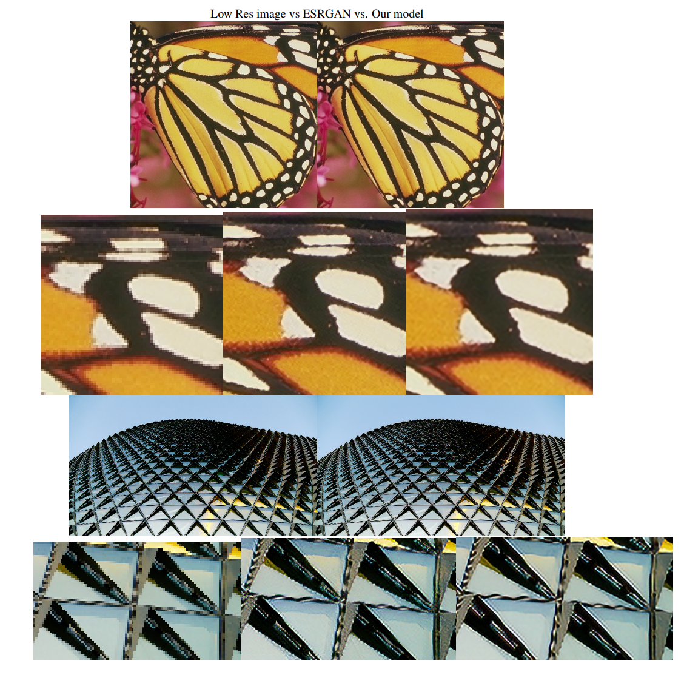

# Enhanced Image Super-Resolution using Improved ESRGAN
## Overview
Image Super-Resolution is the task of converting a low-resolution image to a high-resolution one. In this project, we implemented and improved upon the state-of-the-art ESRGAN model to generate super-resolved images with increased stability and perceptual quality.

We conducted multiple experiments to modify the baseline model, training it on a large dataset. The resulting model produces smooth, realistic images that closely resemble real life and outperform the baseline model.

## Dataset

For our training dataset, we used DIV2K, which has 800 high definition high
resolution images collected from the Internet. The low-resolution images are then generated using bicubic interpolation with
downsampling factor of 4 and Gaussian blur.

Download the dataset: [DIV2K Dataset](https://data.vision.ee.ethz.ch/cvl/DIV2K/)

## Test
#### Dependencies
- Python 3
- Install the dependencies in requirements.txt

### Test models
1. Clone this github repo.
```
git clone https://github.com/williamcfrancis/Super-Resolution-with-Improved-ESRGAN.git
cd Super-Resolution-with-Improved-ESRGAN
```
2. Place your own **low-resolution images** in `./LR` folder.
3. Pretrained model weights are present in './weights' folder
4. Run validate.
```
python validate.py
```
5. The results are in `./results` folder.

## Train
#### Dependencies
- Python 3
- Install the dependencies in requirements.txt

### Train models
1. Clone this github repo
```
git clone https://github.com/rashmip98/Image-Super-Resolution-Using-Modified-ESRGAN.git
cd Super-Resolution-with-Improved-ESRGAN
```
2. Run dataset.py to prepare the datasets.
3. Run train
```
python train.py
```

## Experiments carried out on the ESRGAN baseline


## Results

The following images show the comparison of the Low resolution images, images generated using our baseline model ESRGAN and our final model. The LR images are on the left, ESRGAN outputs are in the middle and our model outputs are on the right. The major difference between the performance of our model and the baseline is that it
generates excessively sharp images which is undesirable as it decreases the perceptual quality of the image. Instead, our model produces smoother images which are more appealing to the human eye and do not look very cartoon-like. The images generated from our model resemble the real life images more closely than the baseline.



